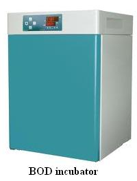

## Theory

&nbsp;

All the aquatic animals rely on the oxygen present in the water (dissolved oxygen) to live. Aquatic microorganisms use the organic matter discharged into the water as food source. Common natural sources of organic matter include plant decay and leaf fall. Bacteria will break down this organic matter using the dissolved oxygen in the water and there by produce less complex organic substances. With increased disposal of waste materials (including organic compounds), the utility of dissolved oxygen by the microorganisms will also increased. So the water becomes depleted in oxygen. In this anaerobic condition, microorganisms will produce offensive products and may result in undesirable effects like fish asphyxiation. So the amount of dissolved oxygen in the water is an indicator of the quality of water.
 

&nbsp;

&nbsp;

Biological oxygen demand is a widely used technique to express the concentration of organic matter in waste water samples. It is a measure of the amount of dissolved oxygen used by microorganisms in the water. If the amount of organic matter in sewage is more, the more oxygen will be utilized by microorganisms to degrade dumping sewage which containing high BOD value. Digestion of these organic compounds in neutral ecosystem such as lakes, rivers etc.can deplete available oxygen and result in fish asphyxiation.

 

&nbsp;

&nbsp;

 

The BOD of a water sample is generally measured by incubating the sample at 20oC for 5 days in the dark room under aerobic condition (in BOD incubator). In the water samples where more than 70% of initial oxygen is consumed, it is necessary to aerate or oxygenate and dilute the sample with BOD free water (de ionized glass distilled water) pass through a column of activated carbon and redistilled to avoid O2 stress.

&nbsp;
 

## Principle

&nbsp;

Under alkaline conditions (by adding Alkaline-iodide-azide), the manganese sulphate produces a white precipitate of manganese hydroxide. This reacts with the dissolved oxygen present in the sample to form a brown precipitate. On acidic condition, manganese diverts to its divalent state and release iodine. This released iodine is titrated against Sodium thiosulphate using starch as an indicator.
